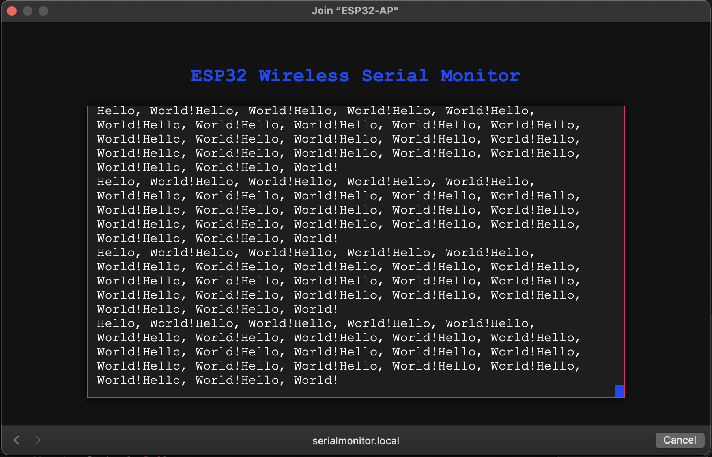
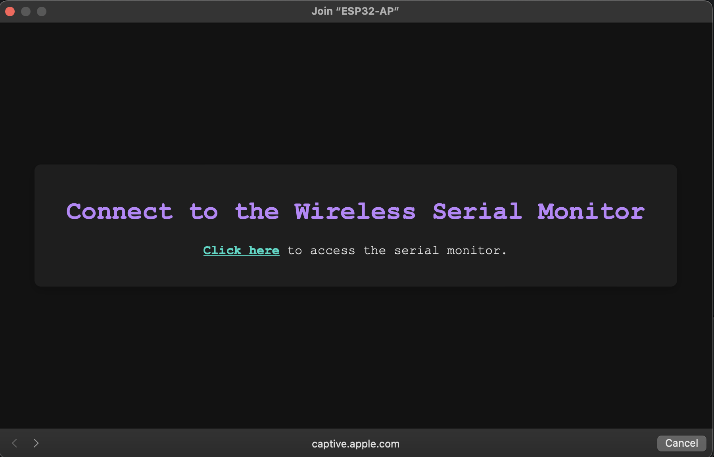

### README

# ESP32 Wireless Serial Monitor

This project sets up an ESP32 as a wireless serial monitor. It creates a Wi-Fi access point, serves a web, handles DNS requests for a captive portal, and uses WebSockets to display real-time logs on the web page.



## Features

- **Captive Portal Access**: Automatically redirects connected devices to the serial monitor page.
- **Web-Based Serial Monitor**: View real-time serial output in a browser.
- **Modular Codebase**: Includes separate modules for wireless monitoring and embedded functionalities.
- **PlatformIO Support**: Easily configurable and adaptable for different ESP32 projects.

## Resources

These Resources were used in this porject's creation.

-   https://www.instructables.com/Implementing-Web-Server-on-ESP32/
-   https://medium.com/@atacanymc/creating-a-captive-portal-with-esp32-a-step-by-step-guide-9e9f78ab87b8
-   https://randomnerdtutorials.com/esp32-websocket-server-sensor/#demonstration

## Libraries

-   Non built in libraries used in this project are:
    -   [ESP Async WebServer](https://github.com/dvarrel/ESPAsyncWebSrv)
    -   [AsyncTCP](https://github.com/dvarrel/AsyncTCP)
    -   [WebSockets](https://github.com/Links2004/arduinoWebSockets)
-   Built in libraries used in this project are:
    -   [ESPmDNS](https://github.com/espressif/arduino-esp32/tree/master/libraries/ESPmDNS)
    -   [DNS Server](https://github.com/espressif/arduino-esp32/tree/master/libraries/DNSServer)
    -   wifi.h
    -   arduino.h

## Project Structure

```plaintext
├── docs
│   ├── Captive.png              # Screenshot of the captive portal
│   └── Monitor.png              # Screenshot of the wireless serial monitor
├── lib
│   ├── EmbeddedFiles
│   │   ├── EmbeddedFiles.cpp
│   │   └── EmbeddedFiles.h
│   └── WirelessMonitor
│       ├── WirelessMonitor.cpp
│       └── WirelessMonitor.h
├── src
│   └── main.cpp                 # Main entry point for the ESP32 system
├── platformio.ini               # PlatformIO project configuration file
└── README.md                    # Project documentation


```
## Requirements

- **Hardware**:
  - ESP32 Development Board with Wi-Fi capability

- **Software**:
  - PlatformIO (recommended) or Arduino IDE
  - ESP-IDF or ESP32 Core for Arduino
  - Libraries:
    - `AsyncTCP`
    - `ESPAsyncWebServer`

## Setup and Installation

1.  **Configure PlatformIO**:
    Ensure `platformio.ini` includes the necessary libraries and settings:

    ```ini
    [env:esp32dev]
    platform = espressif32
    board = esp32dev
    framework = arduino
    lib_deps =
    me-no-dev/AsyncTCP@^1.1.1
    me-no-dev/ESP Async WebServer@^1.2.4
    links2004/WebSockets@^2.4.2
    ESPmDNS

    ```


2.  **Upload Firmware**:
    Compile and upload the firmware code to your ESP32:
    ```sh
    pio run --target upload
    ```

## Usage

1. **Connect to ESP32 Wi-Fi**:

    - Network Name (SSID): `ESP32-AP`
    - Password: `12345678`

2. **Open Web Browser**:

    - The captive portal will popup with a link to directly view the serial monitor which will open `http://serialmonitor.local`
    - 
    - to view in your browser open this http://serialmonitor.local.

3. **View Serial Output**:
    - The web page will display real-time logs from the ESP32.


## License

This project is licensed under the MIT License.
