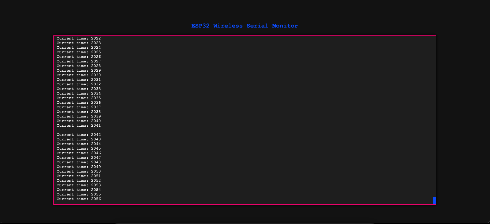
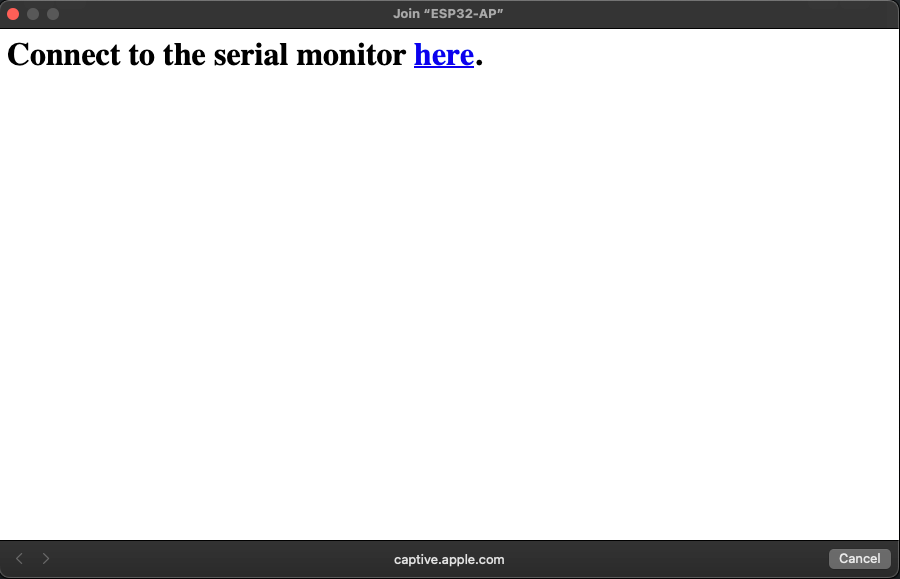

### README

# ESP32 Wireless Serial Monitor

This project sets up an ESP32 as a wireless serial monitor. It creates a Wi-Fi access point, serves a web page from SPIFFS, handles DNS requests for a captive portal, and uses WebSockets to display real-time logs on the web page.



## Resources

These Resources were used in this porject's creation.

-   https://www.instructables.com/Implementing-Web-Server-on-ESP32/
-   https://medium.com/@atacanymc/creating-a-captive-portal-with-esp32-a-step-by-step-guide-9e9f78ab87b8
-   https://randomnerdtutorials.com/esp32-websocket-server-sensor/#demonstration

## Libraries

-   Non built in libraries used in this project are:
    -   [ESP Async WebServer](https://github.com/dvarrel/ESPAsyncWebSrv)
    -   [AsyncTCP](https://github.com/dvarrel/AsyncTCP)
    -   [WebSockets](https://github.com/Links2004/arduinoWebSockets)
-   Built in libraries used in this project are:
    -   [ESPmDNS](https://github.com/espressif/arduino-esp32/tree/master/libraries/ESPmDNS)
    -   [SPIFFS](https://github.com/espressif/arduino-esp32/tree/master/libraries/SPIFFS)
    -   [DNS Server](https://github.com/espressif/arduino-esp32/tree/master/libraries/DNSServer)
    -   wifi.h
    -   arduino.h

## Project Structure

```plaintext
WIRELESS-MONITOR-PROJECT/
├── include/
│ ├── WirelessMonitor.h
│ └── CaptivePortalHandler.h
├── src/
│ ├── main.cpp
│ └── CaptivePortalHandler.cpp
├── data/
│ ├── index.html
│ ├── script.js
│ └── style.css
├── platformio.ini
```

## Prerequisites

-   [PlatformIO](https://platformio.org/) installed in your IDE (e.g., VSCode).
-   ESP32 development board.

## Setup and Installation

1.  **Configure PlatformIO**:
    Ensure `platformio.ini` includes the necessary libraries and settings:

    ```ini
    [env:esp32dev]
    platform = espressif32
    board = esp32dev
    framework = arduino
    lib_deps =
    me-no-dev/AsyncTCP@^1.1.1
    me-no-dev/ESP Async WebServer@^1.2.4
    links2004/WebSockets@^2.4.2
    ESPmDNS

    board_build.filesystem = spiffs
    ```

2.  **Build Filesystem Image**:
    In PlatformIO, click the “PlatformIO: Build Filesystem Image” task to build the SPIFFS filesystem:

    ```sh
    pio run --target buildfs
    ```

3.  **Upload Filesystem Image**:
    Upload the SPIFFS filesystem to the ESP32:

    ```sh
    pio run --target uploadfs
    ```

4.  **Upload Firmware**:
    Compile and upload the firmware code to your ESP32:
    ```sh
    pio run --target upload
    ```

## Usage

1. **Connect to ESP32 Wi-Fi**:

    - Network Name (SSID): `ESP32-AP`
    - Password: `12345678`

2. **Open Web Browser**:

    - The captive portal will popup with a link to directly view the serial monitor which will open `http://serialmonitor.local`
    - 
    - to view in your browser open this http://serialmonitor.local.

3. **View Serial Output**:
    - The web page will display real-time logs from the ESP32.

## File Descriptions

-   **`include/`**: Contains header files for project-wide declarations.
-   **`src/`**: Contains the main source files.
    -   `main.cpp`: Initializes the ESP32, sets up Wi-Fi, web server, DNS, and WebSockets.
    -   `CaptivePortalHandler.cpp`: Handles HTTP requests for the captive portal.
-   **`data/`**: Contains static web files to be served by SPIFFS.
    -   `index.html`: The main web page.
    -   `script.js`: JavaScript for handling WebSocket communication.
    -   `style.css`: CSS for styling the web page.
-   **`platformio.ini`**: PlatformIO configuration file.

## License

This project is licensed under the MIT License.
